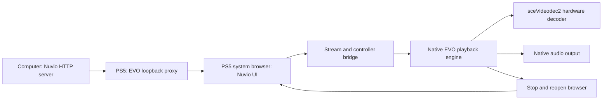

# Architecture

## Component boundaries

[SOURCE-VERIFIED] The port uses the source revisions in [Sources](SOURCES.md).
The computer serves the Nuvio UI. The console runs an EVO-derived native title
with the identity `PPSA99997`.

The browser and the native player have separate lifetimes. The title closes the
browser before it starts native playback and opens it again when playback ends.
The Nuvio route state supplies a previous page for the new browser session. The
port never runs a browser inside the native decoder.

## Source changes

| Area | Change | Reason |
|---|---|---|
| Title metadata | Assign the Nuvio name and `PPSA99997` | Keep the install separate from EVO |
| Data paths | Use `/data/nuvio` | Keep settings separate from EVO |
| Startup | Open the configured Nuvio provider automatically | Start in Nuvio browsing |
| Browser layout | Use the full browser area | Remove the EVO navigation rail beside Nuvio |
| Controller bridge | Direct X to the focused Nuvio element | Avoid activation at the fixed browser pointer |
| Seek request | Accept an active provider demuxer without a local history path | Support seeks in provider streams |
| Seek state | Announce only accepted seek requests | A rejected request must not leave playback in seeking |
| Native loading screen | Draw Nuvio branding during automatic transitions | Hide the EVO menus during those transitions |
| Playback exit | Stop Nuvio playback on Circle | Return without the hidden native confirmation |
| Playback overlays | Keep active playback screens visible | Preserve native controls and dialogs |
| Route state | Enable the Nuvio resume methods for the PS5 flag | Keep browsing state across browser recreation |
| Public login configuration | Read selected values from the official TV package | Enable the official QR login path |
| Host build | Adapt the EVO packaging for macOS | Build without a Linux VM |

`scripts/build.py` and `scripts/polish.py` apply these changes. The generated
patches show changes to upstream files. The adapters also copy the loading
artwork and the RML assets. The patches alone do not perform the full build.

## Controller and screen state

The PS5 browser sends X as a click at its stationary pointer. Nuvio moves its own
focus with the D-pad. `scripts/ps5-input.js` gives the focused Nuvio element
control of primary activation and keeps the Player settings button reachable. A
recursion guard stops the redirected click from activating twice.

The Nuvio build sets `window.__NUVIO_PS5__`, and the router uses that flag for its
route resume methods. The flag preserves the previous restorable route when the
player route starts and rejects an expired or invalid saved route. It does not
enable the webOS services.

Circle stops playback that started through Nuvio, and the EVO playback pump then
requests a browser reopen. Playback that started through the native settings
keeps the EVO confirmation. The loading screen stays hidden while a native
playback session is active.

## Decoder and seeking

EVO owns demuxing, audio, native decoding and stream cleanup, and the port keeps
that engine intact. [TESTED-ON-CONSOLE] The log identifies `sceVideodec2` for the
recorded H.264 streams. See [Validation](VALIDATION.md) for dimensions and hashes.

EVO clears the local media path for web provider streams, and the old seek guard
required that path despite an active demuxer. The adapter removes the path
requirement and keeps the demuxer and stream checks. The controller announces
seeking only after the demuxer accepts the request.

The fix does not change decoder timing and does not force a shorter settle
interval. Source access, keyframes, demuxing and network delay all affect seek
time. A successful seek on one stream does not show performance for another.

## Network endpoints

| Endpoint | Location | Source of the port |
|---|---|---|
| UI HTTP service | Computer LAN interface | Server default 4173, configurable with `--port` |
| Native browser proxy | Console loopback | EVO source default 8686 |
| ShadowMount control API | Console loopback | Helper source default 10101 |
| ELF loader | Explicit console address | Configured loader, observed 9021 in the test |
| FTP service | Explicit console address | Configured FTP service, observed 1337 in the test |

The host UI and the loopback browser connection use HTTP. The public login
endpoints use HTTPS. The proxy does not encrypt the host UI connection.

## Permissions and firmware

The first native title could read `/data` and reach the host server, but it had no
permission to bind the loopback proxy. [TESTED-ON-CONSOLE] The failed bind
returned `errno=13` on firmware 13.60. File access alone therefore did not give
the network permission the proxy needs.

The helper matches `PPSA99997` and `eboot.bin` before it changes credentials, and
it checks the firmware against 13.60. It refuses a missing or ambiguous process
match, applies the capability and authentication values from the SDK privilege
example, then reads those values again to check the change.

The measured app-info buffer has 96 bytes with the title at byte 16. The SDK v0.43
sample places the title at byte 20. The helper uses the measured layout and
refuses other firmware. This is an API buffer, not a kernel offset.

The resident watcher checks every 500 milliseconds. The one-time helper checks
once. Neither helper adds a new exploit or hypervisor access.

## Persistent files

| Console path | Purpose |
|---|---|
| `/data/homebrew/PPSA99997` | Native folder title |
| `/data/nuvio/nuvio.conf` | Host UI origin |
| `/data/nuvio/webui/<host>_<port>.json` | Private browser state for that origin |
| `/data/nuvio/addons.json` | Native addon manifest list |
| `/data/nuvio/evo.log` | Private native diagnostics |
| `/data/homebrew/ps5-homebrew-dev` | Install staging and update backups |

The runtime `libc.prx` comes from independently authored boilerplate in EVO, and
the build does not extract Sony modules. etaHEN can stall when FTP downloads this
generated runtime, so `control-4` hashes the staged runtime on the console
instead.

## Release layout

`make release` writes the store artifact `PPSA99997.zip`, the complete package
`nuvio-ps5-<version>.zip`, the standalone helper ELFs and a `payloads.json` source
for PS5 Payload Manager. See [Release](RELEASE.md).
