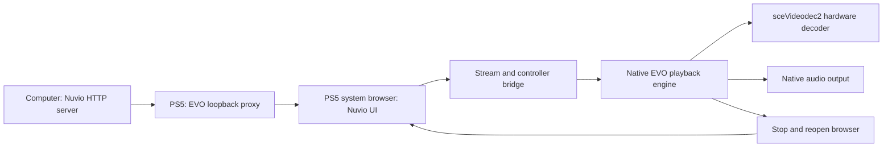

# Architecture

## Component boundaries

[SOURCE-VERIFIED] The port uses the source revisions in [Sources](SOURCES.md).
The host serves the Nuvio UI.
The console runs an EVO-derived native title with identity `PPSA99997`.

The browser and native player have separate lifetimes.
The title closes the browser before it starts native playback.
The title opens the browser again when playback ends.
Nuvio's route state supplies a previous page for the new browser session.
The port does not run a browser inside the native decoder.

## Source changes

| Area | Change | Reason |
|---|---|---|
| Title metadata | Assign Nuvio name and `PPSA99997` | Keep the installation separate from EVO |
| Data paths | Use `/data/nuvio` | Keep settings separate from EVO |
| Startup | Open the configured Nuvio provider automatically | Start in Nuvio browsing |
| Browser layout | Use the full browser area | Remove the EVO navigation rail beside Nuvio |
| Controller bridge | Direct X to Nuvio's focused element | Avoid activation at the fixed browser pointer |
| Seek request | Accept an active provider demuxer without a local history path | Support seeks in provider streams |
| Seek state | Announce only accepted seek requests | Prevent a rejected request from leaving playback in seeking |
| Native loading screen | Draw Nuvio branding during automatic transitions | Hide the EVO menus during those transitions |
| Playback exit | Stop Nuvio playback on Circle | Return without the hidden native confirmation |
| Playback overlays | Keep active playback screens visible | Preserve native controls and dialogs |
| Route state | Enable Nuvio resume methods for the PS5 flag | Preserve browsing state across browser recreation |
| Public login configuration | Read selected values from the official TV package | Enable the official QR login path |
| Host build | Adapt EVO packaging for macOS | Build without a Linux VM |

`scripts/build.py` and `scripts/polish.py` apply these changes.
Generated patches show changes to existing upstream files.
The adapters also copy new loading artwork and RML assets.
The patches alone do not perform the complete build.

## Controller and screen state

The PS5 browser sends X as a click at its stationary pointer.
Nuvio moves its own focus with the D-pad.
`scripts/ps5-input.js` gives the focused Nuvio element control of primary activation.
It leaves the Player settings button accessible.
A recursion guard prevents the redirected click from activating twice.

The Nuvio build sets `window.__NUVIO_PS5__`.
The router uses this flag for its existing route resume methods.
It preserves the previous restorable route when the player route starts.
It rejects an expired or invalid saved route.
The flag does not enable webOS services.

Circle directly stops playback started through Nuvio.
The existing EVO playback pump then requests browser reopening.
Playback started through native settings retains EVO's confirmation.
The loading screen stays hidden while a native playback session is active.

## Decoder and seeking

EVO owns demuxing, audio, native decoding and stream cleanup.
The port keeps that engine intact.
[TESTED-ON-CONSOLE] The baseline log identifies `sceVideodec2` for recorded H.264 streams.
See [Validation](VALIDATION.md) for dimensions and hashes.

EVO deliberately clears the local media path for web provider streams.
The old seek guard required that path, despite an active demuxer.
The adapter removes that path requirement.
It retains demuxer and stream checks.
The controller announces seeking only after the demuxer accepts the request.

The fix does not alter decoder timing or force a shorter settle interval.
Source access, keyframes, demuxing and network delay can affect seek time.
A successful seek on one stream does not establish performance for another stream.

## Network endpoints

| Endpoint | Location | Source of the port |
|---|---|---|
| UI HTTP service | Computer LAN interface | Server default 4173, configurable with `--port` |
| Native browser proxy | Console loopback | EVO source default 8686 |
| ShadowMount control API | Console loopback | Helper source default 10101 |
| ELF loader | Explicit console address | Configured loader, observed 9021 in the test |
| FTP service | Explicit console address | Configured FTP service, observed 1337 in the test |

The host UI and loopback browser connection use HTTP.
The public login endpoints use HTTPS.
The proxy does not encrypt the host UI connection.

## Permissions and firmware

The initial native title could read `/data` and reach the host server.
It still lacked permission to bind the loopback proxy.
[TESTED-ON-CONSOLE] The failed bind returned `errno=13` on firmware 13.60.
File access therefore did not establish the required network permission.

The helper matches `PPSA99997` and `eboot.bin` before changing credentials.
It checks the firmware against 13.60.
It refuses missing or ambiguous process matches.
It applies capability and authentication values from the SDK privilege example.
It reads those values again to check the change.

The measured app-info buffer has 96 bytes with the title at byte 16.
The SDK v0.43 sample places the title at byte 20.
The helper uses the measured layout and refuses other firmware.
This observation concerns an API buffer, not a guessed kernel offset.

The resident watcher checks every 500 milliseconds.
The one-time helper checks only once.
Neither helper supplies a new exploit or hypervisor access.

## Persistent files

| Console path | Purpose |
|---|---|
| `/data/homebrew/PPSA99997` | Native folder title |
| `/data/nuvio/nuvio.conf` | Host UI origin |
| `/data/nuvio/webui/<host>_<port>.json` | Private browser state for that origin |
| `/data/nuvio/addons.json` | Native addon manifest list |
| `/data/nuvio/evo.log` | Private native diagnostics |
| `/data/homebrew/ps5-homebrew-dev` | Install staging and update backups |

The runtime `libc.prx` comes from independently authored boilerplate in EVO.
The build does not extract Sony modules.
etaHEN can stall when FTP downloads this generated runtime.
Control-4 hashes the staged runtime on the console instead.
