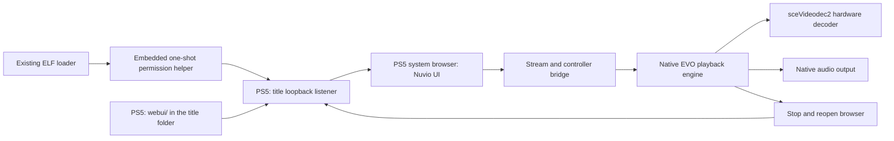

# Architecture

## Component boundaries

[SOURCE-VERIFIED] The port uses the source revisions in [Sources](SOURCES.md).
The console runs an EVO-derived native title with the identity `PPSA99997`. The
browser UI travels inside the title folder. The title loads its embedded
permission helper through the existing ELF loader and serves the UI over loopback.

The browser and the native player have separate lifetimes. The title closes the
browser before it starts native playback and opens it again when playback ends.
The Nuvio route state supplies a previous page for the new browser session. The
port never runs a browser inside the native decoder.

## Source changes

| Area | Change | Reason |
|---|---|---|
| Title metadata | Assign the Nuvio name and `PPSA99997` | Keep the install separate from EVO |
| Data paths | Use `/data/nuvio` | Keep settings separate from EVO |
| Startup | Open the configured Nuvio provider automatically | Start in Nuvio browsing |
| Browser layout | Use the full browser area | Remove the EVO navigation rail beside Nuvio |
| Controller bridge | Direct X to the focused Nuvio element | Avoid activation at the fixed browser pointer |
| Seek request | Accept an active provider demuxer without a local history path | Support seeks in provider streams |
| Seek state | Announce only accepted seek requests | A rejected request must not leave playback in seeking |
| Native loading screen | Draw Nuvio branding during automatic transitions | Hide the EVO menus during those transitions |
| Playback exit | Stop Nuvio playback on Circle | Return without the hidden native confirmation |
| Playback overlays | Keep active playback screens visible | Preserve native controls and dialogs |
| Route state | Enable the Nuvio resume methods for the PS5 flag | Keep browsing state across browser recreation |
| Public login configuration | Read selected values from the official TV package | Enable the official QR login path |
| Browser UI hosting | Serve `webui/` from the title over loopback | Remove the computer that served the UI |
| Host build | Adapt the EVO packaging for macOS | Build without a Linux VM |

`sce_sys/param.json` in this repository holds the title identity and content
version. The build copies those values into the generated title, so a release tag
carries the metadata a store needs.

`scripts/build.py` and `scripts/polish.py` apply these changes. The generated
patches show changes to upstream files. The adapters also copy the loading
artwork and the RML assets. The patches alone do not perform the full build.

## Controller and screen state

The PS5 browser sends X as a click at its stationary pointer. Nuvio moves its own
focus with the D-pad. `scripts/ps5-input.js` gives the focused Nuvio element
control of primary activation and keeps the Player settings button reachable. A
recursion guard stops the redirected click from activating twice.

The Nuvio build sets `window.__NUVIO_PS5__`, and the router uses that flag for its
route resume methods. The flag preserves the previous browsing route when playback starts.
The native handoff saves a one-use profile and route snapshot and marks its return URL.
Startup restores that profile and page when the native player reopens the browser.
Title and stream pages can resume on PS5. Ordinary launches retain profile selection.
The return check rejects changed, deleted or expired profile snapshots.
It does not enable the webOS services.

Circle stops playback that started through Nuvio, and the EVO playback pump then
requests a browser reopen. Playback that started through the native settings
keeps the EVO confirmation. The loading screen stays hidden while a native
playback session is active.

## Decoder and seeking

EVO owns demuxing, audio, native decoding and stream cleanup, and the port keeps
that engine intact. [TESTED-ON-CONSOLE] The log identifies `sceVideodec2` for the
recorded H.264 streams. See [Validation](VALIDATION.md) for dimensions and hashes.

EVO clears the local media path for web provider streams, and the old seek guard
required that path despite an active demuxer. The adapter removes the path
requirement and keeps the demuxer and stream checks. The controller announces
seeking only after the demuxer accepts the request.

The fix does not change decoder timing and does not force a shorter settle
interval. Source access, keyframes, demuxing and network delay all affect seek
time. A successful seek on one stream does not show performance for another.

## Network endpoints

| Endpoint | Location | Source of the port |
|---|---|---|
| UI HTTP service | Console loopback (`nuvio.elf`, port 4173) | Payload default 4173 |
| Native browser proxy | Console loopback | EVO source default 8686 |
| ShadowMount control API | Console loopback | Helper source default 10101 |
| ELF loader | Explicit console address | Configured loader, observed 9021 in the test |
| FTP service | Explicit console address | Configured FTP service, observed 1337 in the test |

The host UI and the loopback browser connection use HTTP. The public login
endpoints use HTTPS. The proxy does not encrypt the loopback UI connection.

## Permissions and firmware

The first native title could read `/data` and reach the host server, but it had no
permission to bind the loopback proxy. [TESTED-ON-CONSOLE] The failed bind
returned `errno=13` on firmware 13.60. File access alone therefore did not give
the network permission the proxy needs.

The payload matches `PPSA99997` and `eboot.bin` before it changes credentials, and
it checks the firmware against 13.60. It refuses a missing or ambiguous process
match, applies the capability and authentication values from the SDK privilege
example, then reads those values again to check the change.

The measured app-info buffer has 96 bytes with the title at byte 16. The SDK v0.43
sample places the title at byte 20. The helper uses the measured layout and
refuses other firmware. This is an API buffer, not a kernel offset.

The same payload also serves the browser UI from `webui/` in the title folder,
because the title cannot bind its proxy until the payload grants the privilege.
The payload watches once every quarter second, and the one-time helper `promote.elf`
promotes once. Neither adds a new exploit or hypervisor access.

### Unpromoted loopback diagnostic

[SOURCE-VERIFIED] The pinned EVO proxy creates an IPv4 TCP socket, binds
`127.0.0.1:8686`, then listens. The previous log combined bind and listen
failures, so the build adapter now records socket, bind, listen and accepted
browser connections separately.

[SOURCE-VERIFIED] Nuvio's `sce_sys/param.json` has title identity and app
attributes, but no inspected field that grants the proxy's missing network
permission. The package adapter signs `eboot.elf` into `eboot.bin` and includes
`sce_module/libc.prx`. It does not add a credential change or runtime launch
argument. This inspection does not establish what firmware 13.60 grants a
fake-signed title.

[SOURCE-VERIFIED] The native import table includes `libSceNet.prx`,
`libScePosixForWebKit.prx` and `libkernel.prx`. These imports identify linked
interfaces. They do not show whether the title can bind a loopback socket.
`param.json` requests the `launchActivity` intent, and the package script builds
the app module directly. It does not supply a separate launch command or
environment variables.

[SOURCE-VERIFIED] The Stremio port at `a4b12fb515a3044f073f4befba0dd90d8244eddd`
adapts socket `fcntl`, DNS lookup, thread stack size and `pipe`. Its packaging
also sets memory fields in `param.json` and signs a native title. Those changes
do not implement a listener or alter title credentials. Nuvio copies none of
that code. The pin and archive hash are in [Sources](SOURCES.md).

[UNKNOWN] An unpromoted Nuvio title has not yet demonstrated that it can bind
and accept a loopback connection on firmware 13.60. See [Validation](VALIDATION.md)
for the diagnostic build and console sequence. Keep the boot helper until that
test passes.

### Signing metadata experiment

[SOURCE-VERIFIED] EVO's signer accepts `--authority` and `--auth-info`.
The SDK v0.43 `samples/install_app/Makefile` provides both values for its sample.
The build option `--auth-profile sdk-install-app` copies those exact values into
the title's signed container and records their source hash in the receipt.
It leaves the generated runtime unchanged.

[SOURCE-VERIFIED] Inspected kstuff revision
`d44a25400ecfab7e31afe9eb2c7c7c99770e8f56` reads embedded authentication info
and uses it instead of its default executable profile.
See [Sources](SOURCES.md) for the implementation reference.

[INFERENCE] A title signing profile may remove the runtime promotion step.
[UNKNOWN] The SDK profile's listener permission on firmware 13.60 still needs
the unpromoted console test.
The release packager rejects this experimental profile.

## Browser UI hosting

The build copies the Nuvio bundle into `webui/` inside the title folder, so the
store archive is self-contained. `nuvio.elf` serves that folder on
`127.0.0.1:4173` with GET and HEAD only, confined below the folder, and writes
`/data/nuvio/nuvio.conf` on the first boot when the file is absent. The title's
own proxy fetches the pages through it exactly as it fetched a LAN server before,
so the hook injection, route resume and playback handoff keep working.

A payload runs as its own process rather than inside the title, so the server is
single-threaded and driven from the payload's own loop. [TESTED-ON-CONSOLE] A
threaded accept loop bound the port and then stopped answering, while a loop on
the process's main thread served every request.

## Persistent files

| Console path | Purpose |
|---|---|
| `/data/homebrew/PPSA99997` | Native folder title, including `webui/` |
| `/data/nuvio/nuvio.conf` | Console UI origin the title opens |
| `/data/nuvio/webui/<host>_<port>.json` | Private browser state for that origin |
| `/data/nuvio/addons.json` | Native addon manifest list |
| `/data/nuvio/evo.log` | Private native diagnostics |
| `/data/homebrew/ps5-homebrew-dev` | Install staging and update backups |

`control-5.elf` hashes the title's raw signed eboot on-console and writes an
immutable backup named by that hash before an update. It also hashes the staged
replacement. FTP `RETR` returns a transformed ELF for these PS5 containers.

The runtime `libc.prx` comes from independently authored boilerplate in EVO, and
the build does not extract Sony modules. etaHEN can stall when FTP downloads this
generated runtime, so `control-4` hashes the staged runtime on the console
instead.

## Release layout

`make release` writes the store artifact `PPSA99997.zip`, the complete package
`nuvio-ps5-<version>.zip`, the standalone helper ELFs and a `payloads.json` source
for PS5 Payload Manager. See [Release](RELEASE.md).
